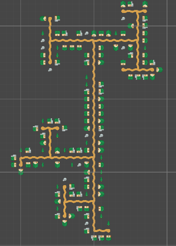

# Procedural World Generation in Unity  

This project implements a **2D procedural world generator** in Unity.  
It focuses on generating natural-looking landscapes, biomes, and towns using various techniques.  

---

## About This Project  

This work was originally developed as part of my diploma project: **Implementation and Analysis of Selected Procedural World Generation Algorithms in Sandbox Games Using Unity**.  
The goal was to research and implement multiple approaches to world generation, analyze their performance, and compare the visual outcomes.  

---

## Features  

### Terrain Generation  
- **Algorithms**: Perlin Noise and Value Noise.  
- **Adjustable Parameters**: map size, scale, octaves, persistence, lacunarity, seed.  
- **Results**:  
  - *Perlin Noise*: smooth, organic landscapes with natural transitions.  
  - *Value Noise*: sharper, blockier terrain; slightly faster (~10%).  

**Examples:**  
  
  

---

### Biome Generation  
Two approaches for biome assignment:  

1. **Voronoi Diagrams** – create distinct geometric partitions; results are clear but somewhat artificial and more memory-intensive.  
2. **Climate-Based Approach** – uses temperature and moisture noise maps to produce smoother and more realistic biome layouts; faster and lighter on memory.  

In both approaches, you can choose the number of biome types and customize them.  

**Examples:**  
  
  

---

### Town Generation  
Two procedural town models:  

- **Grid-Based**: ordered layouts with right-angle roads and uniform blocks (modern or colonial style); slightly higher memory usage.  
- **L-System Based**: branching road networks with irregular layouts and organic growth patterns (historical style); more space-efficient.  

**Examples:**  
  
  

---

## Requirements  
- Unity **2020.3.32f1** (other versions may also work)  
- Tested on:  
  - Windows 11 Pro (64-bit)  
  - Intel Core i7-6700 @ 3.40 GHz  
  - 8 GB DDR4 RAM  
  - NVIDIA GeForce GTX 960 (4 GB)  

---

## Usage  
1. Clone or download this repository.  
2. Open the project in Unity.  
3. Select the `MapGenerator` object in the hierarchy; a custom editor will appear.  
4. Adjust parameters in the Inspector to experiment with different generation algorithms.  
5. Click the **Generate** button.  

---

## License  
MIT License
